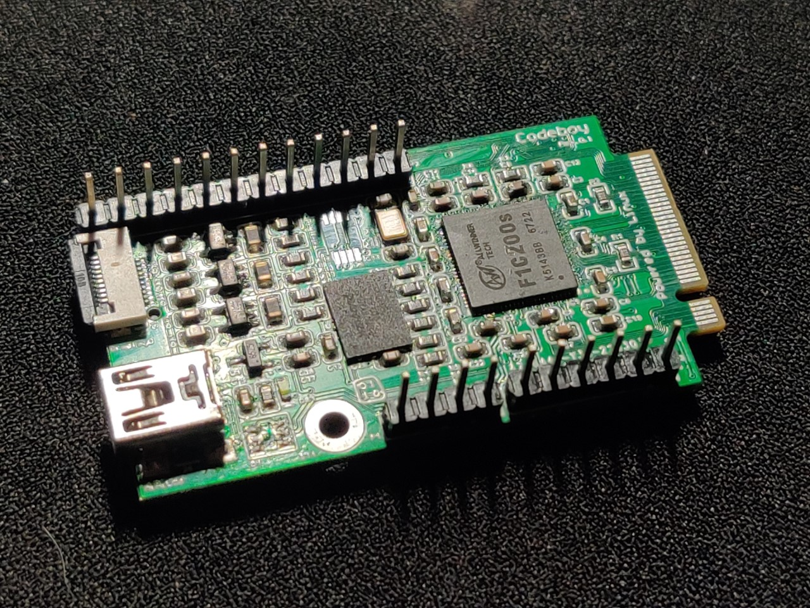

#  仓鼠熊 HamsterBear
------

官方网站:
[`https://embeddedboys.github.io/HamsterBear`](https://embeddedboys.github.io/HamsterBear)

仓库地址:
[`https://github.com/embeddedboys/HamsterBear`](https://github.com/embeddedboys/HamsterBear)

[**`HamsterBear(仓鼠熊)`**]() 是基于[`Allwinner（全志科技）`](https://www.allwinnertech.com/)[`F1C200s`]() SoC 设计的嵌入式 Linux 开发板，我们在 `3x5cm` 尺寸上的PCB集成了众多功能，并且采用了M.2接口，方便开发多种多样的底板。

为了让其更加生动形象，我们给`HamsterBear`的底板取了个外号叫做**`履带(Track)`**，这是我们给它设计的第一款底板 **`HamsterBear Track Wireless`**

[`点击查看更多实物图`](assets/gallery.md)

## 软件配置
------

* `SoC` : F1C200s arm926-ejs

* `Kernel` - mainline v5.17

* `U-Boot` - mainline v2022.2

* `Buildroot` - v2022.2
    X Server
    Gtk
    python3
    VNC
    Qt5等

## 工程结构
------
    docs/                           # 本站工程
        
    hardware/                       # 有关硬件设计的部分
        core/                       # 核心板
        datasheets/                 # 芯片手册
        tracks/                     # 底板

    software/                       # 有关软件设计的部分
        bootable/                   # 可启动文件
        bsp/                        # 项目的最小系统工程
            u-boot/                 # u-boot工程
            linux/                  # linux工程
            buildroot/              # buildroot工程
            toolchain/              # 交叉编译工具链

        modules/                    # 外部的驱动程序
        packages/                   # 外部的应用软件
        scripts/                    # 脚本

    references/                    # 本项目所参考的内容

    LICENSE                        # 本项目的许可证
    AUTHORS                        # 本项目涉及到的作者
    THANKS                         # 致谢
    README.md                      # 项目自述文件

## 说明
------
如果你打算从该工程的基础上进行二次开发，请阅读开发者页面中的内容。

工程发布于 MIT 许可证下，有关该许可证的详细信息，请到 `关于 -> 许可证` 中查看

## FAQ
------

#### **1. 酷，我接下来应该做什么？**
**用户向导 -> [快速上手](howtouse.md)** 章节里介绍了基本的用法，更详细的用法位于 **`使用文档`** 中。

#### **2. 网站里文档资料好少**

资料还在整理更新中，正在爆肝中！ 相关文档会先在我的博客园[hfwz](https://cnblogs.com/hfwz)发布，
然后会尽快同步到这里。

#### **3. 项目都有哪些资料开源了呢？**

软硬件完全开源！核心板是AD工程，底板LCEDA专业版，pcb工程以及gaber文件都有，软件包括bsp+应用全套，
这部分资料和文档还在整理编写中，uboot、kernel、buildroot全部都用的主线，工程内有自动化编译脚本（还没做完善），
主线代码拉下来打上提供的`补丁`和`defconfig`就可以直接编译出镜像。

另外，因为用的都是主线代码，所以正在计划将kernel和uboot直接整合到buildroot中，这是为了给不修改内核和uboot玩家
提供的方式，如果你要在内核和uboot上做二次开发，还是推荐分开来做！

#### **4. 为什么都要用主线代码？**

个人认为，不玩主线，等于白玩！在主线代码上进行开发，即使不至于向社区提交补丁，但你也可以参与到
内核的开发当中来！当然也得有一定基础！

主线代码还有很多坑没填好，这些坑是不是就等着优秀的你就来填！

#### **5. 为什么核心板设计了一些接口？**

因为考虑到有些玩家可能只会使用一块核心板，所以做上了一些fpc和排针接口，方便使用外接模块和面包板play。

#### **6. 为什么核心板用了MIniUSB接口，而不用type-C**

这个起始设计的最初就考虑到了，但是这颗SoC并不支持type-C接口，而是使用USB ID确定主从机的USB类型，所以
选择权确定在了MicroUSB和MiniUSB之间，因为MiniUSB在使用寿命方面要比MicroUSB长，所以最后选择了MiniUSB。

#### **7. 有没有考虑量产，公开售卖**

暂时还没有这个计划，因为底层还有些东西没适配好，另外文档也没写完，拿一个半成品出来卖的话，没什么意思，
如果后期过程顺利的话，可以考虑小批量生产，在tb等销售。
但是资料还是完全公开的，你们可以在此基础上自己拿去修改打样适配play。